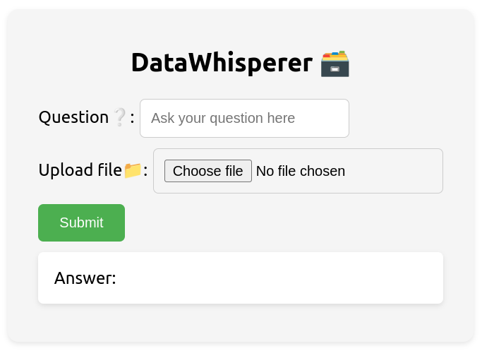

# File Based Chatbot

## Introduction

File Based Chatbot is a chatbot that allows you to analyze your local files using Large Language Models (LLMs). You can upload PDFs, Markdown, Text, and Document files to the chatbot and ask questions related to the content of those files.

## Execution of Project

To run this project in your environment, follow these steps:

1. **Clone the Repository**:

   ```
   git clone https://github.com/your-username/file-based-chatbot.git
   ```

2. **Create a Virtual Environment**:
   Create a virtual environment using Python or Conda and activate it.

3. **Install Backend Dependencies**:
   Navigate to the `backend` folder and install the dependencies using:

   ```
   pip install -r requirements.txt
   ```

4. **Add your OPENAPI_KEY**:
   Add your OPENAPI_KEY to the `.env` file in the `backend` folder.

5. **Start the Backend**:
   Start the backend app using Uvicorn:

   ```
   uvicorn main:app --reload
   ```

6. **Install Node.js and npm**:
   Ensure you have Node.js and npm installed. For example, Node.js version 20.11.1 and npm version 10.2.4 or higher.

7. **Install Frontend Dependencies**:
   Navigate to the `frontend` folder and install the dependencies using:

   ```
   npm install
   ```

8. **Start the Frontend**:
   Start the frontend app using:
   ```
   npm start
   ```
   

## Additional Content

- **File Types Supported**: PDF, Markdown, Text, and Document files.
- **Backend Framework**: FastAPI for creating RESTful APIs.
- **Frontend Framework**: React for the user interface.
- **Dependencies**: See `requirements.txt` for backend dependencies and `package.json` for frontend dependencies.
